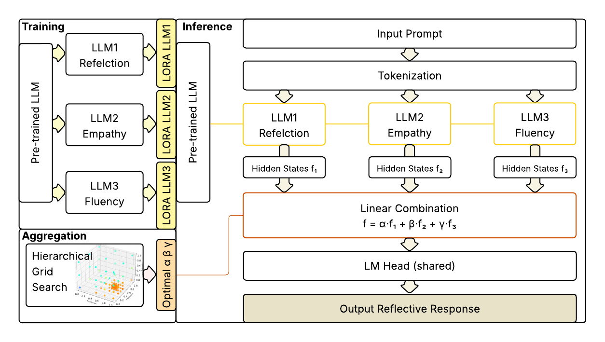

# EMORL: Ensemble Multi-Objective Reinforcement Learning for Efficient and Flexible LLM Fine-Tuning

## Original Paper
EMORL: Ensemble Multi-Objective Reinforcement Learning for Efficient and Flexible LLM Fine-Tuning

## Code Overview
- `/el_training.py`: ensembled training for individual objectives (ours), uniform weighted and dynaopt training (baselines)
- `/el_aggregation.py`: hidden states aggregation (ours), parameters and logits aggregation (comparison) using hierarchical grid search
- `/el_test.py`: general evaluation experiments for all models (for DMORL needs weights combination as input)
- `/utils_additional.py`: utils about load and save models, generation configs, convergence check etc.
- `/utils_lora.py`: utils about lora implementation
- `/model_empathy.py`: program to load and implement 'bert-empathy' scoring model
- `/dynaopt_lib`: original utils from 'dynaopt' repository with minimum change
- `/lora_results`: trained single-objective models

## Dependency Setup
```
# Keep sure cuda and cuda toolkit installed
conda create --name myenv python=3.9
conda activate myenv
git clone https://github.com/engineerkong/EMORL.git
cd EMORL
pip install -r requirements.txt
```

## Datasets and Model Checkpoints Download
Download [PAIR dataset](https://lit.eecs.umich.edu/downloads.html) and [Psych8k dataset](https://huggingface.co/datasets/EmoCareAI/Psych8k) into `EMORL/data`.

Download [reflection scoring weights](https://drive.google.com/file/d/1RPvMVLe7WS_spOvQI8FmPz6khI-MWWtA/view?usp=drive_link) into `EMORL/weights`.

## Quick Start
```
python el_training.py --num_steps=10000
python el_aggregation.py --aggregation_mode="states"
```
